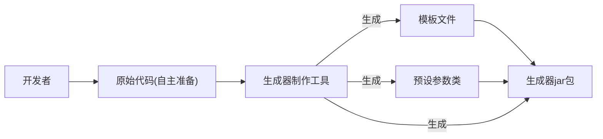

## 进入到第二阶段： 开发 代码生成器制作工具
1. 制作工具实现思路
2. 元信息定义
3. 制作工具开发

具体目标：生成器制作能快速将一个项目制作为可以**动态定制部分内容**的代码生成器。
并且以一个Spring Boot初始化项目模板（Maven项目）为例，演示如何根据自己的需要动态生成Java后端
初始项目。

业务流程

#### 实现思路
1. 基础开发：移除第一阶段中的硬编码 在已有项目模板的基础上，通过读取 _人工配置_ 
跑通代码生成器的核心制作流程（之前的输入输出路径写死的）
2. 增强配置文件：实现Spring Boot初始化项目模板生成器为目标，给配置文件增加更多参数
可以灵活的制作更复杂的代码生成器
3. 增强工具能力 给代码生成器制作工具增加更多的鞥哪里，可以帮助开发者自动生成/更新配置文件，FTL动态模板文件等
提高制作效率。

