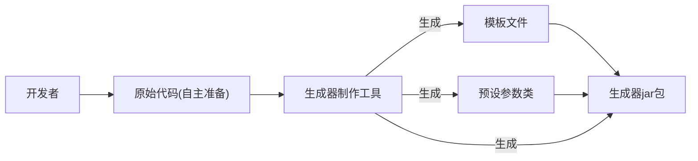

## 进入到第二阶段： 开发 代码生成器制作工具
1. 制作工具实现思路
2. 元信息定义
3. 制作工具开发

具体目标：生成器制作能快速将一个项目制作为可以**动态定制部分内容**的代码生成器。
并且以一个Spring Boot初始化项目模板（Maven项目）为例，演示如何根据自己的需要动态生成Java后端
初始项目。

业务流程

#### 实现思路
1. 基础开发：移除第一阶段中的硬编码 在已有项目模板的基础上，通过读取 _人工配置_ 
跑通代码生成器的核心制作流程（之前的输入输出路径写死的）
2. 增强配置文件：实现Spring Boot初始化项目模板生成器为目标，给配置文件增加更多参数
可以灵活的制作更复杂的代码生成器
3. 增强工具能力 给代码生成器制作工具增加更多的鞥哪里，可以帮助开发者自动生成/更新配置文件，FTL动态模板文件等
提高制作效率。

对于有了FTL模板文件，也有了要动态填充的参数信息，那么就可以把这些
信息保存为**配置文件**，让制作工具 **读取配置文件** 来生成
数据模型文件，生成Picocli命令类，生成Generator(其中有文件路径要动态配置)
，打jar包，封装脚本等。

前面提到的配置文件我们称为元信息，用于描述项目的数据，比如项目的名称，作者等。
元信息把它用JSON格式来存储，meta.json放在resources下
元信息的字段配置 和数据库表的设计很类似，都是根据实际的业务需求，设置合适的存储结构，字段名称和类别

如何确定字段配置：
参考其他项目的元信息配置，前端的package.json后端的application.yml
在结合自己的项目要用到的配置信息。

对于当前的项目：
1. 基本信息：例如项目名称，作者，版本号
2. 生成文件信息：输入文件路径，输出路径，文件类别(目录或文件)，生成类别（静态或动态）等。
3. 数据模型信息：参数的名称，描述，类型，默认值。
>注意：和设计库表一样，配置文件中能提前确认的信息就提前确认，之后尽量只新增字段避免修改字段。
> 后面随着工具能力的拓展增强，元信息中的配置肯定越来越多。在外层尽量用对象来组织字段，而不是数组。在不确定信息的情况下更利于字段的拓展。

控制生成代码的基础包名 
"basePackage": "com.lpy",
生成器版本号，影响Maven的pom.xml文件，从而影响jar包的名称
"version": "1.0"

>ps:freeMarker 中语法modelInfo.defaultValue?c的作用是将任何类型的变量(例如boolean int)都转换为字符串

>在meta.json中要确定哪些文件是静态文件哪些文件是动态文件，我认为应该直接检索动态文件模板的
> .ftl文件的前缀，不过目前的做法是在json文件中表明，但文件名要用相对地址，是用src/file折叠
> 还是用src:[file] 这样递归呢？鱼皮选择折叠路径，因为路径并不一定要展开折叠是可以使用的，并且这样
> 层数较少，让json结构更加清晰精简，利于前期开发和维护。
> **注意：项目开发前期可以选择更简单的做法，但一定要想好退路及可拓展性，应对未来可能的需求变更**