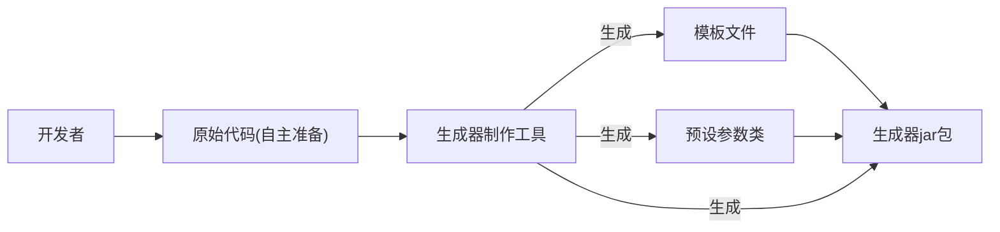

## 进入到第二阶段： 开发 代码生成器制作工具
1. 制作工具实现思路
2. 元信息定义
3. 制作工具开发

具体目标：生成器制作能快速将一个项目制作为可以**动态定制部分内容**的代码生成器。
并且以一个Spring Boot初始化项目模板（Maven项目）为例，演示如何根据自己的需要动态生成Java后端
初始项目。

业务流程

#### 实现思路
1. 基础开发：移除第一阶段中的硬编码 在已有项目模板的基础上，通过读取 _人工配置_ 
跑通代码生成器的核心制作流程（之前的输入输出路径写死的）
2. 增强配置文件：实现Spring Boot初始化项目模板生成器为目标，给配置文件增加更多参数
可以灵活的制作更复杂的代码生成器
3. 增强工具能力 给代码生成器制作工具增加更多的鞥哪里，可以帮助开发者自动生成/更新配置文件，FTL动态模板文件等
提高制作效率。

对于有了FTL模板文件，也有了要动态填充的参数信息，那么就可以把这些
信息保存为**配置文件**，让制作工具 **读取配置文件** 来生成
数据模型文件，生成Picocli命令类，生成Generator(其中有文件路径要动态配置)
，打jar包，封装脚本等。

前面提到的配置文件我们称为元信息，用于描述项目的数据，比如项目的名称，作者等。
元信息把它用JSON格式来存储，meta.json放在resources下
元信息的字段配置 和数据库表的设计很类似，都是根据实际的业务需求，设置合适的存储结构，字段名称和类别

如何确定字段配置：
参考其他项目的元信息配置，前端的package.json后端的application.yml
在结合自己的项目要用到的配置信息。

对于当前的项目：
1. 基本信息：例如项目名称，作者，版本号
2. 生成文件信息：输入文件路径，输出路径，文件类别(目录或文件)，生成类别（静态或动态）等。
3. 数据模型信息：参数的名称，描述，类型，默认值。
>注意：和设计库表一样，配置文件中能提前确认的信息就提前确认，之后尽量只新增字段避免修改字段。
> 后面随着工具能力的拓展增强，元信息中的配置肯定越来越多。在外层尽量用对象来组织字段，而不是数组。在不确定信息的情况下更利于字段的拓展。

控制生成代码的基础包名 
"basePackage": "com.lpy",
生成器版本号，影响Maven的pom.xml文件，从而影响jar包的名称
"version": "1.0"

>ps:freeMarker 中语法modelInfo.defaultValue?c的作用是将任何类型的变量(例如boolean int)都转换为字符串

>在meta.json中要确定哪些文件是静态文件哪些文件是动态文件，我认为应该直接检索动态文件模板的
> .ftl文件的前缀，不过目前的做法是在json文件中表明，但文件名要用相对地址，是用src/file折叠
> 还是用src:[file] 这样递归呢？鱼皮选择折叠路径，因为路径并不一定要展开折叠是可以使用的，并且这样
> 层数较少，让json结构更加清晰精简，利于前期开发和维护。
> **注意：项目开发前期可以选择更简单的做法，但一定要想好退路及可拓展性，应对未来可能的需求变更**

### 接下来是进一步的改进
1. 可移植性优化
2. 功能优化
3. 健壮性优化
4. 可扩展性优化
***
1. 可移植性，现在的工作是做了个生成器的生成器，生成器是来改对应的项目文件，为什么要把生成器也当做一个项目
来写一个生成器的生成器呢？写生成器是因为项目中的一些文件或者参数是可以设计成动态可配置的。然而在生产器中这些项目文件的地址
是否是静态或者动态文件，这些参数也是写死的，所以需要一个更上层的抽象类，也就是生成器的生成器。
可移植性本质上的意思就是项目换到另一个环境或者机器上能否正常运行。一般就是把绝对路径改为相对路径，绝对路径只在
配置文件里面写。之前生成的生成器项目里面有绝对路径，现在做的修改就是让生成的生成器项目里面只有相对路径，能直接运行了。
其实最后要的就是生成器。生成器的生成器只是为了方便将配置文件的信息用动态模板加读取配置类的方式获得。
2. 功能优化
    1. 加入动态生成的README.md文件
    2. 生成的生成器项目的target文件夹中有很多不需要的文件，例如编译代码 archive等等
     **注意：在项目开发阶段不要删除代码或者推导，而是新开一个分支或者重建一个项目或新增一段代码来做**
3. 健壮性优化，健壮性是指程序在不同条件下能否稳定运行。一个健壮的程序能够在各种不同的用户输入和使用方式下，保持正常运行，并且能正确处理
异常情况，而不是整个程序崩溃或导致严重错误。
常用的优化方式有：
    1. 输入校验
    2. 异常处理，自动重试
    3. 故障回复（比如事务 
这次制作工具项目影响代码生成结果的，也是需要用户修改的核心内容
是元信息的配置文件，所以一定要对元信息做输入校验，设置好默认值
以及对输入导致的异常做好异常处理。

| 字段          | 默认值              | 校验规则 |
|:------------|:-----------------|:--------|
| name        | my-codegenerator |         |
| description | 我的模板代码生成器        |         |
| basepackage | com.lpy          |         |
在进行输入校验前，可以先用表格的形式对字段的**默认值**和**校验规则**进行梳理
校验函数鱼皮一般单独写个校验类来实现，因为校验是比较灵活的。也不使用spring的validation
在校验类的实现中，介绍了一个概念：圈复杂度（cyclomatic Complexity）
> 圈复杂度 先将代码表示成 控制流图然后计算 公式：M(复杂度) = E(边的数量) -N(节点的数量) +2P(连接分支点如if,循环的数量)
> 一般判断：1-10低复杂度 11-20 中等复杂度 20以上一般考虑重构 注意计算的是平均复杂度，就是每个函数的复杂度

介绍了三种降低圈复杂度的方法：
1.ctrl+alt+M refactor->extract method抽取方法 减少平均复杂度
2.alt+enter 控制反转 减少嵌套层数
3.用工具类来封装部分逻辑 可以调用工具类 例如hutool,可以看看工具类里封装的
的方法有没有合适的，或者自己封装，就我封装你的封装。

4. 可拓展性优化
可拓展性优化是在不改变程序结构或代码的情况下，能够灵活的添加新的功能以适应新的需求和项目变化
可拓展性又可以分为功能拓展性，性能拓展性，资源拓展性。做为开发人员，最关注的还是功能。
例如用枚举值代替编码就是提高可拓展性的一种方法
还有就是接下来的模板方法模式，在MainGenerator文件中，作为生成的入口文件
作用是读取元信息，然后根据固定的流程生成不同的代码或者执行不同的操作。

对于这种有标准流程的代码，我们使用模版方法设计模式进行优化
#### 模版方法设计模式
吃饭怎么吃 睡觉怎么睡 学习怎么学

| 人物  |   吃饭   | 睡觉| 学习| 
|:---:|:------:|:---:|:---:|
| 小李： | 家里吃米饭  | 床上躺着睡|  看视频学习|
| 小孙: |  学校吃套餐 |  桌子上趴着睡 | 看书学习  |

这样,规范子类的行为，复用父类现成的执行流程，在子类中通过覆写方法也可以定义每一步的具体操作

 **实现过程** 
`MainGenerator` 的标准流程包括：复制原始文件，代码生成，构建jar包，封装脚本，生成精简版的程序。
具体实现：
1. 新建一个抽象父类，创建抽象方法先复制现有方法
2. 把现有方法里面的每个步骤抽取成一个独立的方法(注意确保每个方法的作用域为protected 且不能为static static表明是类的方法不是对象的方法)

