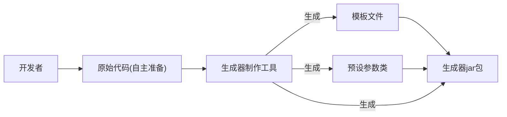
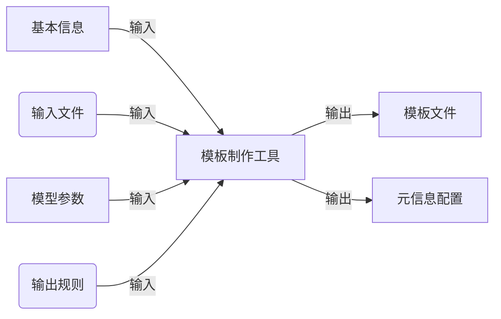

## 进入到第二阶段： 开发 代码生成器制作工具
1. 制作工具实现思路
2. 元信息定义
3. 制作工具开发

具体目标：生成器制作能快速将一个项目制作为可以**动态定制部分内容**的代码生成器。
并且以一个Spring Boot初始化项目模板（Maven项目）为例，演示如何根据自己的需要动态生成Java后端
初始项目。

业务流程

#### 实现思路
1. 基础开发：移除第一阶段中的硬编码 在已有项目模板的基础上，通过读取 _人工配置_ 
跑通代码生成器的核心制作流程（之前的输入输出路径写死的）
2. 增强配置文件：实现Spring Boot初始化项目模板生成器为目标，给配置文件增加更多参数
可以灵活的制作更复杂的代码生成器
3. 增强工具能力 给代码生成器制作工具增加更多的鞥哪里，可以帮助开发者自动生成/更新配置文件，FTL动态模板文件等
提高制作效率。

对于有了FTL模板文件，也有了要动态填充的参数信息，那么就可以把这些
信息保存为**配置文件**，让制作工具 **读取配置文件** 来生成
数据模型文件，生成Picocli命令类，生成Generator(其中有文件路径要动态配置)
，打jar包，封装脚本等。

前面提到的配置文件我们称为元信息，用于描述项目的数据，比如项目的名称，作者等。
元信息把它用JSON格式来存储，meta.json放在resources下
元信息的字段配置 和数据库表的设计很类似，都是根据实际的业务需求，设置合适的存储结构，字段名称和类别

如何确定字段配置：
参考其他项目的元信息配置，前端的package.json后端的application.yml
在结合自己的项目要用到的配置信息。

对于当前的项目：
1. 基本信息：例如项目名称，作者，版本号
2. 生成文件信息：输入文件路径，输出路径，文件类别(目录或文件)，生成类别（静态或动态）等。
3. 数据模型信息：参数的名称，描述，类型，默认值。
>注意：和设计库表一样，配置文件中能提前确认的信息就提前确认，之后尽量只新增字段避免修改字段。
> 后面随着工具能力的拓展增强，元信息中的配置肯定越来越多。在外层尽量用对象来组织字段，而不是数组。在不确定信息的情况下更利于字段的拓展。

控制生成代码的基础包名<br>
"basePackage": "com.lpy",
生成器版本号，影响Maven的pom.xml文件，从而影响jar包的名称
"version": "1.0"

>ps:freeMarker 中语法modelInfo.defaultValue?c的作用是将任何类型的变量(例如boolean int)都转换为字符串

>在meta.json中要确定哪些文件是静态文件哪些文件是动态文件，我认为应该直接检索动态文件模板的
> .ftl文件的前缀，不过目前的做法是在json文件中表明，但文件名要用相对地址，是用src/file折叠
> 还是用src:[file] 这样递归呢？鱼皮选择折叠路径，因为路径并不一定要展开折叠是可以使用的，并且这样
> 层数较少，让json结构更加清晰精简，利于前期开发和维护。
> **注意：项目开发前期可以选择更简单的做法，但一定要想好退路及可拓展性，应对未来可能的需求变更**

### 接下来是进一步的改进
1. 可移植性优化
2. 功能优化
3. 健壮性优化
4. 可扩展性优化
***
1. 可移植性，现在的工作是做了个生成器的生成器，生成器是来改对应的项目文件，为什么要把生成器也当做一个项目
来写一个生成器的生成器呢？写生成器是因为项目中的一些文件或者参数是可以设计成动态可配置的。然而在生产器中这些项目文件的地址
是否是静态或者动态文件，这些参数也是写死的，所以需要一个更上层的抽象类，也就是生成器的生成器。
可移植性本质上的意思就是项目换到另一个环境或者机器上能否正常运行。一般就是把绝对路径改为相对路径，绝对路径只在
配置文件里面写。之前生成的生成器项目里面有绝对路径，现在做的修改就是让生成的生成器项目里面只有相对路径，能直接运行了。
其实最后要的就是生成器。生成器的生成器只是为了方便将配置文件的信息用动态模板加读取配置类的方式获得。
2. 功能优化
    1. 加入动态生成的README.md文件
    2. 生成的生成器项目的target文件夹中有很多不需要的文件，例如编译代码 archive等等
     **注意：在项目开发阶段不要删除代码或者推导，而是新开一个分支或者重建一个项目或新增一段代码来做**
3. 健壮性优化，健壮性是指程序在不同条件下能否稳定运行。一个健壮的程序能够在各种不同的用户输入和使用方式下，保持正常运行，并且能正确处理
异常情况，而不是整个程序崩溃或导致严重错误。
常用的优化方式有：
    1. 输入校验
    2. 异常处理，自动重试
    3. 故障回复（比如事务 
这次制作工具项目影响代码生成结果的，也是需要用户修改的核心内容
是元信息的配置文件，所以一定要对元信息做输入校验，设置好默认值
以及对输入导致的异常做好异常处理。

| 字段          | 默认值              | 校验规则 |
|:------------|:-----------------|:--------|
| name        | my-codegenerator |         |
| description | 我的模板代码生成器        |         |
| basepackage | com.lpy          |         |
在进行输入校验前，可以先用表格的形式对字段的**默认值**和**校验规则**进行梳理
校验函数鱼皮一般单独写个校验类来实现，因为校验是比较灵活的。也不使用spring的validation
在校验类的实现中，介绍了一个概念：圈复杂度（cyclomatic Complexity）
> 圈复杂度 先将代码表示成 控制流图然后计算 公式：M(复杂度) = E(边的数量) -N(节点的数量) +2P(连接分支点如if,循环的数量)
> 一般判断：1-10低复杂度 11-20 中等复杂度 20以上一般考虑重构 注意计算的是平均复杂度，就是每个函数的复杂度

介绍了三种降低圈复杂度的方法：
1.ctrl+alt+M refactor->extract method抽取方法 减少平均复杂度
2.alt+enter 控制反转 减少嵌套层数
3.用工具类来封装部分逻辑 可以调用工具类 例如hutool,可以看看工具类里封装的
的方法有没有合适的，或者自己封装，就我封装你的封装。

4. 可拓展性优化
可拓展性优化是在不改变程序结构或代码的情况下，能够灵活的添加新的功能以适应新的需求和项目变化
可拓展性又可以分为功能拓展性，性能拓展性，资源拓展性。做为开发人员，最关注的还是功能。
例如用枚举值代替编码就是提高可拓展性的一种方法
还有就是接下来的模板方法模式，在MainGenerator文件中，作为生成的入口文件
作用是读取元信息，然后根据固定的流程生成不同的代码或者执行不同的操作。

对于这种有标准流程的代码，我们使用模版方法设计模式进行优化
#### 模版方法设计模式
吃饭怎么吃 睡觉怎么睡 学习怎么学

| 人物  |   吃饭   | 睡觉| 学习| 
|:---:|:------:|:---:|:---:|
| 小李： | 家里吃米饭  | 床上躺着睡|  看视频学习|
| 小孙: |  学校吃套餐 |  桌子上趴着睡 | 看书学习  |

这样,规范子类的行为，复用父类现成的执行流程，在子类中通过覆写方法也可以定义每一步的具体操作

<br>**实现过程**<br>
`MainGenerator` 的标准流程包括：复制原始文件，代码生成，构建jar包，封装脚本，生成精简版的程序。
具体实现：
1. 新建一个抽象父类，创建抽象方法先复制现有方法
2. 把现有方法里面的每个步骤抽取成一个独立的方法(注意确保每个方法的作用域为protected 且不能为static static表明是类的方法不是对象的方法)

我们之后的目标是 生成Spring Boot模板项目，让开发者快速定制生成自己的
Spring Boot项目

模板由Spring Boot万用项目模板精简而成，并不保证能够完全正常运行。。。
通过分析需求，挖掘出生成器应该具备的通用能力。
1. 替换生成的代码包名，类似于之前的basePackage,但由于会用到包名的地方太多了，如果都要自己制作
ftl模板，成本高而且容易出现遗漏，要能用工具自动生成模板文件。
2. 需求：控制是否生成帖子相关功能
例如PostController,PostService,PostMapper,PostMapper.xml,Post实体类等。
能力：一个参数同时控制多个文件或多段代码
3. 控制是否开启跨域，例如corsConfig.java相关文件
能力：同上
4. 自定义Knife4jConfig 接口文档配置
修改Knife4jConfig文件中配置，比如title,description,version,apis
能力：需要用户输入的参数较多，可以定义一组隔离的配置参数。
5. 是否开启redis 修改redis相关代码，如application.yml，pom.xml，MainApplication.java
同上上
6. 是否开启Elasticsearch,修改相关代码，如PostController,PostService,PostServiceImpl,application.yml,
PostEsDTO文件是否生成

### 整理清楚之后，就分文别类由易到难增强生成器的功能

继续需求分析
在之前配置通用能力增强时，更改了数据模型配置，将模型参数进行分组后，ftl的动态模板也必须
跟着修改。说明动态模板和元信息配置是有很强的绑定关系的。
并且还遗留了一个需求没有解决->替换生成的代码包名。
对于Spring Boot项目模板这种较复杂的项目，里面用到包名的java文件太多了，不能每个都要人工来挖坑制作模板。
所以目前的制作工具还有两大问题：
1. 要人工提前准备动态模板
2. 需要根据动态模板编写对应的配置，参数越多，越容易出现和模板不一致的风险。

如何解决呢？
**让制作工具根据自己的想法，自动给项目文件“挖坑”，并生成对应的动态模板文件和元信息配置**
> 当然，制作工具更多是为了提高自己的效率，不能覆盖到所有的定制需求


### 核心设计
> 程序的本质就是帮我们完成原本需要人工进行的操作

如果是人工进行的话
1. 指定一个原始的，待“挖坑”的输入文件
2. 明确文件中需要被动态替换的内容和模型参数
3. 自己编写FreeMaker FTL模板文件
4. 自己编写生成器的元信息配置，包括基本信息，文件配置，模型参数配置。

分析：1,2步是必须要人为确定的内容，而是3,4步看起来是可以用制作工具来完成的
流程图

明白了之后，先实现一个最基础的模板制作工具，然后再陆续给工具增加功能。
### 基础功能实现
#### 进阶功能
1. 想实现一个工作目录，每次模板制作都属于不同的工作空间，互补影响。
将maker项目下的.temp临时目录作为工作空间的根目录，并在项目的.gitignore文件中忽略该目录
2. 分步制作能力：在制作模板时，是一步一步地替换参数，制作模板。
要能做到分步制作，追加配置的能力。
   1. 输入过一次的信息，不用再重复输入
   2. 后续制作时，不用再次复制原始项目；而是可以在原有文件的基础上，多次追加或覆盖心动文件
   3. 后续制作时，可以在原有配置的基础上，多次追加或覆盖配置。
然而，要实现这个能力，很好的方法是让制作工具有状态。
**有状态**：指程序或请求多次执行时，下一次执行保留对上一次执行的记忆。比如用户登录后服务器会记住用户的信息，下一次请求就能正常使用系统。
   <br>而**无状态**则是每次程序或者请求执行，都像第一次执行一样，没有任何历史信息。很多Restful API会采用无状态的设计，能够节省服务器的资源占用。
   要实现有状态，需要两个要素：唯一标识和存储。而在上一步“工作目录隔离”中，已经给每个工作空间分配了一个唯一的id作为标识(使用雪花算法
   long id = IdUtil.getSnowflakeNextId();) 并且将id作为工作空间的目录名称，相当于使用本地文件系统作为了id的存储。
   那么我们只要在第一次制作时，生成唯一的id,然后在后续制作时，使用相同的id,就能找到之前的工作空间目录，从而追加文件或配置。
### 更多功能实现
现在的模板制作工具可以通过多次执行来制作多个模板文件，但还比较麻烦。
1. 现在需要实现多个模板文件同时制作的能力。
有2种方法：
   1. 输入文件目录，同时处理该目录下的所有文件
   2. 输入多个文件路径，同时处理这些文件。
2. 文件过滤功能 现在可以输入文件目录或者输入多个文件路径来生成模板
   但有时候，例如控制帖子生成相关功能是否开启，需要输入多个文件路径，这也很麻烦，怎么样做到更加优雅呢？就像平时find搜索文件一样，给模板制作工具增加文件过滤功能，通过多种不同的
   过滤方法来选择文件。
   *  过滤范围：根据文件名称或者文件内容
   *  过滤规则: 包含（contain ,前缀匹配（stratsWith,后缀匹配（endsWith,正则(regex,相等（equals
   >工具已经支持输入多个文件/目录 可以每个文件/目录指定自己的过滤规则，且能同时指定多条过滤规则(要同时满足)
   ```json
   {
    "files": [
      {
        "path": "路径",
        "filters"[
          {
            "range": "fileName",
            "rule": "regex",
            "value": ".*lala.*"
          },
          {
            "range": "fileContent",
            "rule": "contains",
            "value": "haha"
          }
        ]
      }
    ]
   }
   ```
3. 文件分组：目前制作工具已经支持对文件进行分组(groupKey,groupName)，并且通过给组设置condition的方式，支持用单个模型参数同时控制一组文件。
同理，对于文件的配置也要有快速按组生成的能力。
分组策略有两种:
   1. 一个文件信息配置（FileInfoConfig)对应一次分组。如果传入的Path是目录则目录下的所有文件为同组。
   2. 一个完整的文件配置(TemplateMakerFileConfig)对应一次分组。即配置files列表中的所有文件都属于同组。
   这里使用第二种
4. 模型分组
给模型配置类加上分组子类，有condition,groupName,groupKey三个属性

### 第八节
#### 1.BUG修复
1. 同配置多次生成会变成静态文件，这个自己已经修复了。之前的逻辑是，如果没有替换内容就把类型设置为静态。
2. 错误处理了新生成的ftl文件，即扫描目录时把ftl也扫描进去了-》对于dofilter得到的文件列表，再用.stream().filter().collect();做一次过滤，过滤掉.ftl结尾的模板文件
3. 文件的输入输出路径翻了，生成器在生成项目时，inputPath应该是模板文件，所以setInputPaht(outputPath)
4. 调整配置文件的位置，从项目内移到和项目同级，这样扫描项目根目录时不会影响配置文件

#### 2.参数封装 - 易用性优化
每次使用制作工具，都要自己编写各种配置对象，templateMakerFileConfig templateMakerFileModelConfig，meta
有没有更简单的方式呢，我们可以把所有模板制作工具需要的参数统一封装为一个对象，这样就可以通过传递一个JSON配置文件（或者后续的HTTP Post 请求）来快速填充参数。

#### 3.制作 Spring Boot 项目模板生成器
思路：通过一步一步编写模板制作工具所需的配置文件，自动生成模板和元信息文件，依次完成动态生成需求；然后在通过制作工具的生成能力，得到可执行的代码生成器文件。
一共有7个需求
##### 需求1：替换生成的代码包名
用户传入 basePackage 模型参数，对Spring Boot模板项目代码中所有出现包名的地方进行替换。
用到包名的代码很多，例如注解@MapperScan里面也有包名。

`持久化项目路径` 
先完善一下配置追加的能力。如果非首次制作，配置文件中已经存在了`originProjectPath`参数，后续则不用
在配置文件中指定该参数
在生成器代码中，只有获取`sourceRootPath`时用到了originProjectPath 修改成自动读取工作空间下的第一个目录(项目根目录)
##### 需求2：控制是否生成帖子相关功能
允许用户传入 `needPost` 模型参数，控制帖子功能相关的文件是否生成，PostController,PostService,PostMapper,PsetMapper.xml,Post实体类
> PostMapper 和 PostMapper.xml是在使用MyBatis框架进行数据库操作时用到的两个组件
> Mybatis是一个留下的Java持久层宽假，提供了一种半自动的数据库操作方式，通过XML或注解来映射SQL语句，并将结果映射回Java对象
> 1. XXXMapper 通常是个Java接口，它定义了操作数据库的方法。这些方法对应SQL语句，用于执行数据库的CRUD操作。
> 接口垫命名方法与SQL相对应
> MyBatis会使用这个接口作为与数据库交互的入口，通过动态代理机制在运行时实现接口定义的方法，并将它们与XML文件中定义的SQL语句关联起来。
> 也可以在接口垫方法上直接使用@Select @Insert @Update @Delete等方法来直接在接口上定义SQL语句，不使用XML文件
> 2. XXX.xml 这个文件中包含了与XXXMapper接口中定义的方法相对于的SQL语句。
> xml文件还可以定义结果映射（Result Mapping）,让MyBatis将数据库查询到结果集以指定的方式映射到Java对象的属性上

##### 需求3：外层去重组内文件 
思路：加入一个输出配置类TemplateMakerOutputConfig来设置输出相关的属性

##### 需求4：控制是否需要开启跨域
用户传入 needCors 模型参数，控制跨域相关的文件 CorsConfig.java 是否生成
编写配置：
##### 需求5：自定义Knife4jConfig 接口文档配置
让用户输入 `needDocs` 参数，决定是否需要开启接口文档配置，然后如果要开启则让用户输入一组配置参数
##### 需求6：自定义MySQL配置信息
允许用户传入一组MySQL数据库模型参数，修改application.yml配置文件中MySQL的URL，username,password的值
##### 需求7：控制是否开启Redis
允许用户传入 needRedis 模型参数，控制是否开启和Redis相关代码。需要修改application.yml pom.xml MainApplication.java
这个需求需要人工来做，因为每个文件和Redis有关的代码都不一样
##### 需求8：控制是否开启ElasticSearch
允许用户传入 needEs 模型参数，控制是否生成ES相关代码。需要修改PostController,PostService,PostServiceImpl,application.yml
还要控制PostDTO文件的生成
> DTO表示数据传输对象（Data Transfor Object,简称DTO类）DTO是一种设计模式
> 用来表示从数据库或其他数据源中检索出来的数据，或者用于封装想要发送到客户端的数据esDTO一般代表了
> 一个ES中的文档Document 索引是表，文档是一条数据 字段是列
> 类似的还有VO（value object) 也是设计模式的概念之一，用于表示展示层的数据模型。
> 用于封装用户界面（展示层）显示的数据，与后端的数据传输模型（DTO）或持久化模型（entity,实体对象）相区分
> VO一般有几个特点，1是展示需求，一般为了方便前端，对数据格式做了处理，或者是组合数据或派生属性

MyBatis的参数占位符#{}会和freeMarker中的语法冲突
用标签<#noparse>套一下 <#noparse>#{minUpdateTime}</#noparse>


